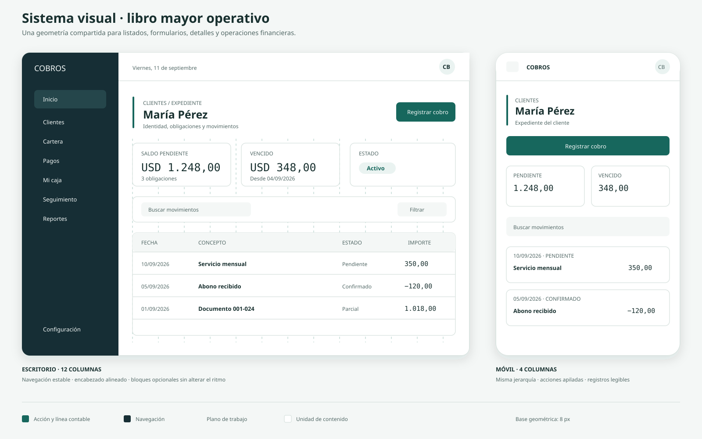
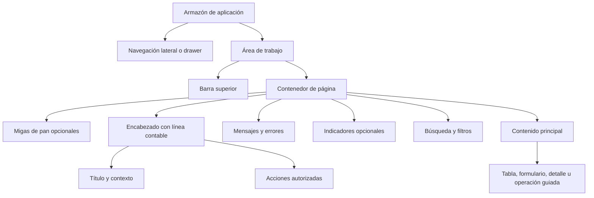
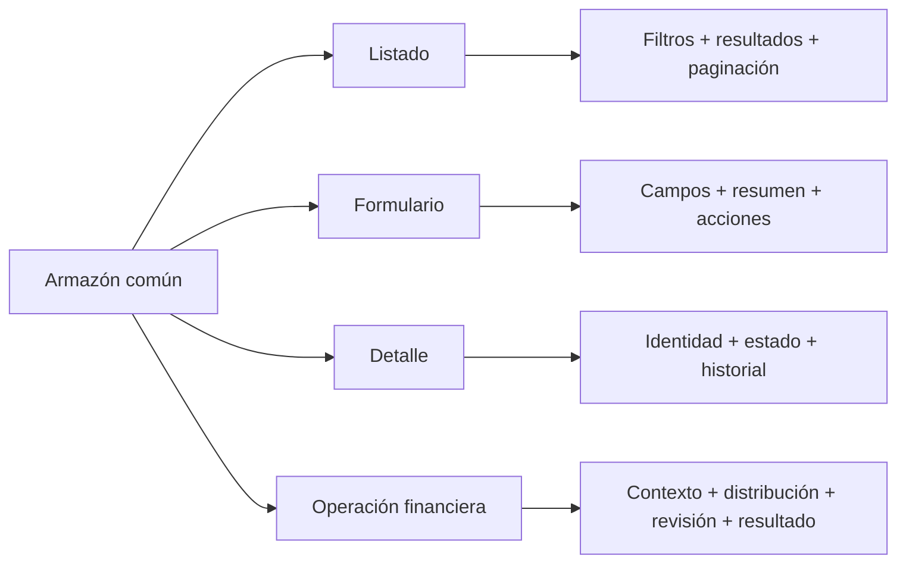
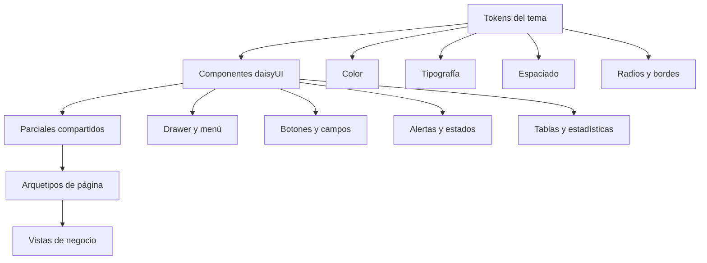

# Arquitectura visual de las interfaces

Este documento traduce el sistema visual maestro a una estructura común para todas las vistas. Las decisiones detalladas de color, tipografía, geometría, componentes y accesibilidad están en [`design-system/sistema-de-cobros/MASTER.md`](../design-system/sistema-de-cobros/MASTER.md).

## Composición universal

## Cuatro patrones de página

| Patrón | Vistas principales | Distribución de escritorio | Adaptación móvil |
|---|---|---|---|
| Listado | Clientes, catálogo, documentos, cartera, pagos | Filtros y tabla a 12 columnas | Filtros apilados y registros legibles |
| Formulario | Cliente, documento, contrato, configuración | Formulario `8/12` y resumen `4/12` | Una columna; resumen antes de acciones |
| Detalle | Expediente, obligación, pago, contrato, turno | Contenido `8/12` y contexto `4/12` | Identidad, contexto e historial apilados |
| Operación guiada | Cobro, cierre, importación, devolución | Flujo de cuatro pasos dentro de 12 columnas | Un paso visible y una acción principal |

## Regla de simetría

La simetría no exige que todas las pantallas tengan la misma cantidad de contenido. Exige que cada elemento ocupe una posición predecible:

1. La navegación conserva dimensiones y orden.
2. El título comienza siempre sobre la misma columna.
3. La acción principal ocupa el extremo derecho del encabezado o toda la anchura disponible en móvil.
4. Indicadores, filtros y cuerpo comparten límites laterales.
5. Las acciones finales de formulario mantienen `Cancelar` a la izquierda y la acción principal a la derecha.
6. Estados vacíos, carga y errores reemplazan el cuerpo sin alterar su marco.
7. Los importes se alinean por el separador decimal y utilizan tipografía monoespaciada.

## Jerarquía de componentes

Las vistas de negocio no redefinen la apariencia de los componentes. Una variación reutilizable se resuelve primero con una variante de daisyUI, después con utilidades de Tailwind y, únicamente cuando sea necesario, mediante una utilidad compartida.

## Contrato para construir una vista

Antes de implementar una pantalla se debe decidir:

- Patrón de página utilizado.
- Título, descripción y ubicación jerárquica.
- Acción primaria y acciones secundarias autorizadas.
- Datos de identidad y estado que permanecerán visibles.
- Estado vacío, carga, error, conflicto y éxito.
- Transformación móvil de tablas, filtros y acciones.
- Parciales existentes que puede reutilizar.

Una pantalla no se considera conforme si copia el armazón, incorpora estilos aislados o introduce una nueva geometría sin registrarla en el sistema visual.
